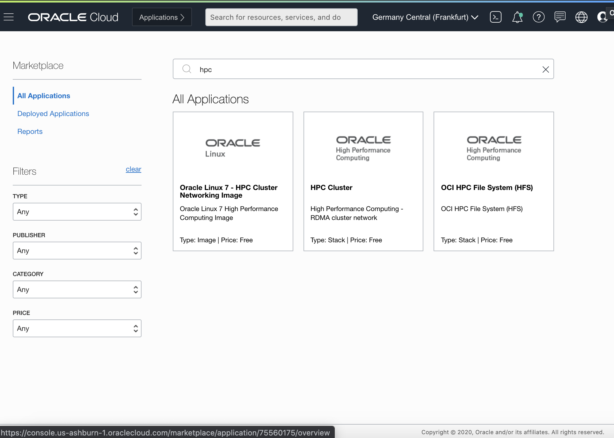
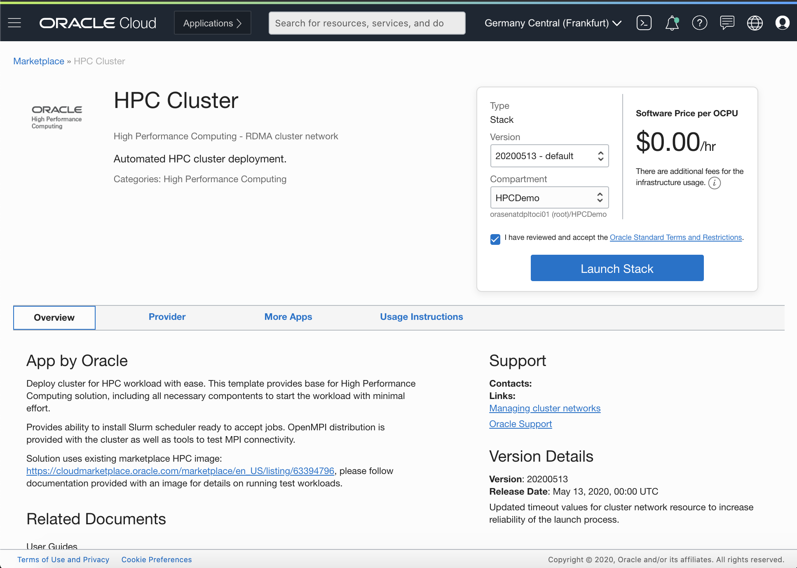
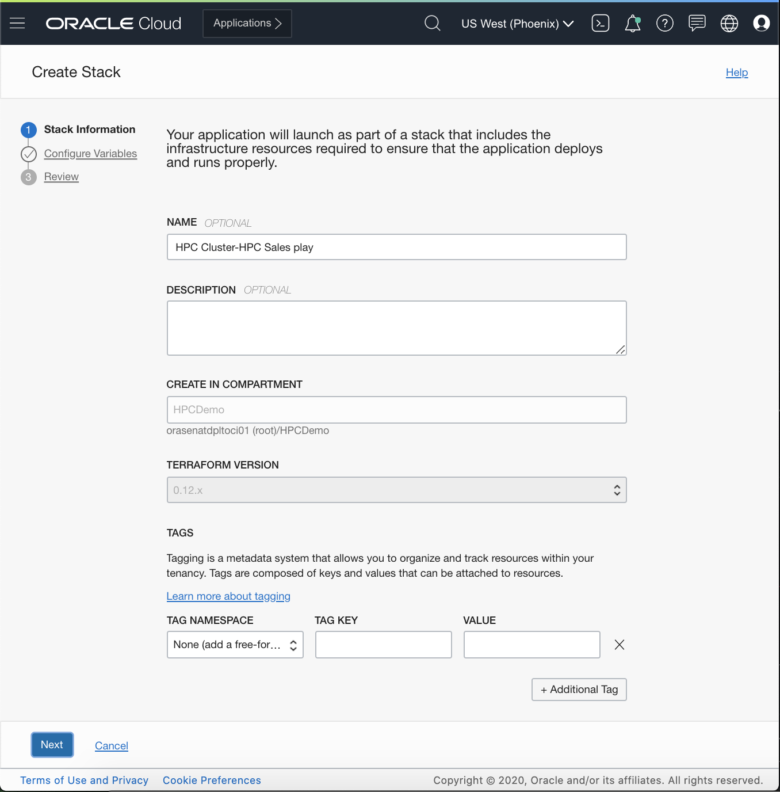
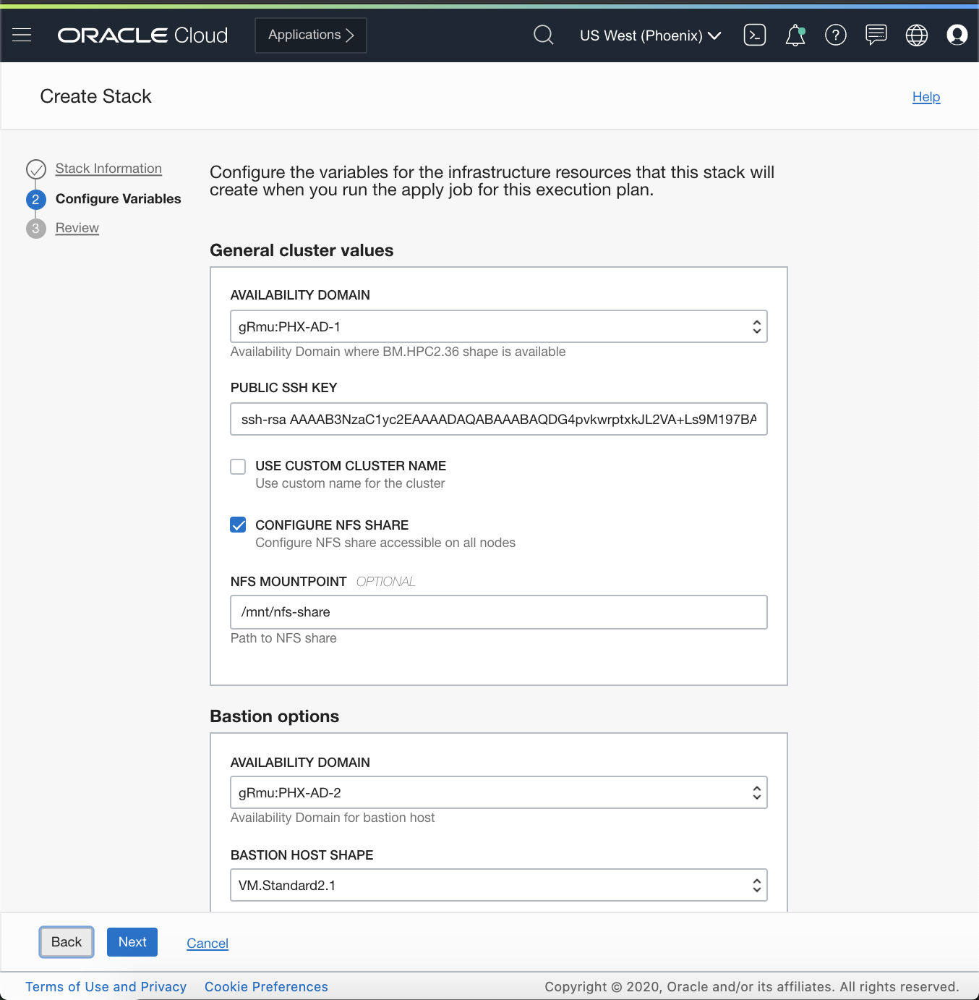
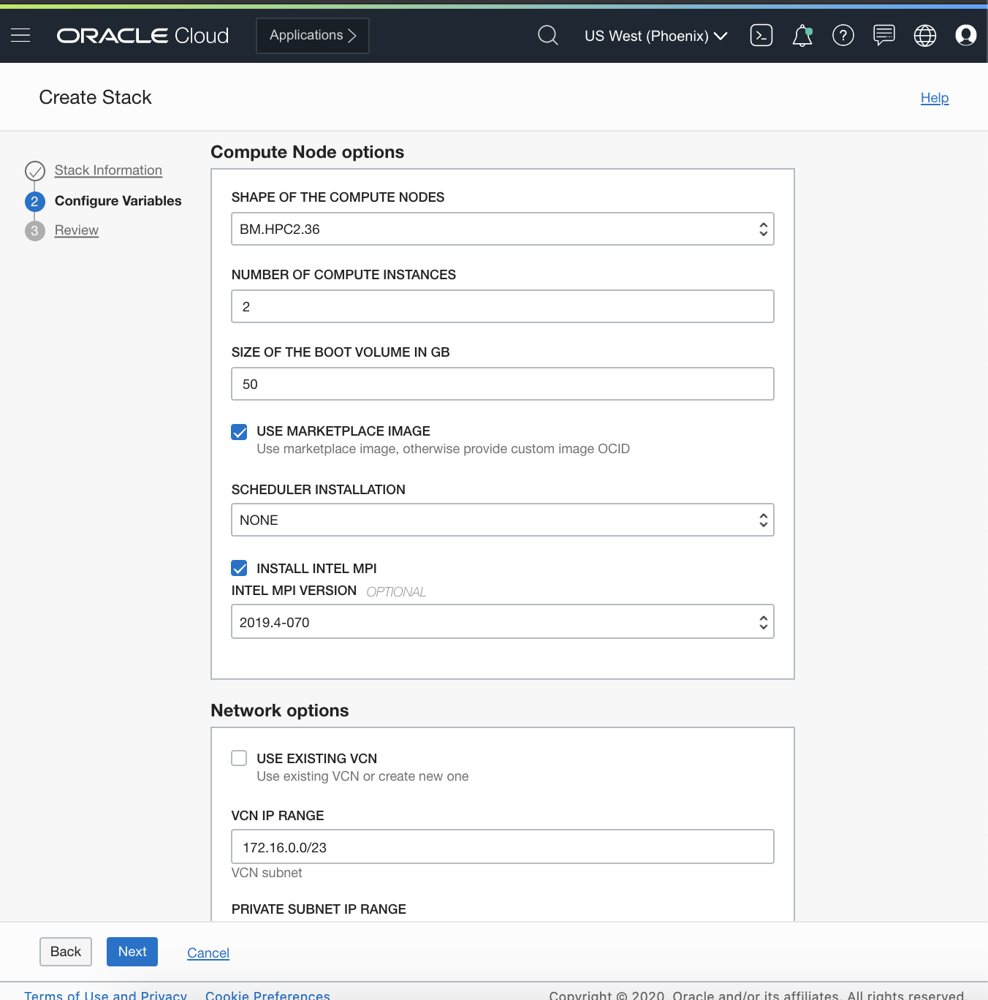
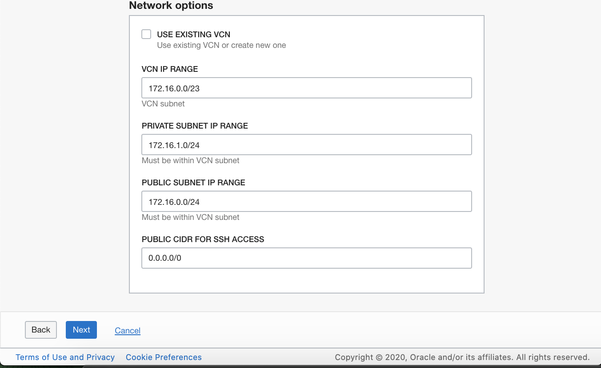
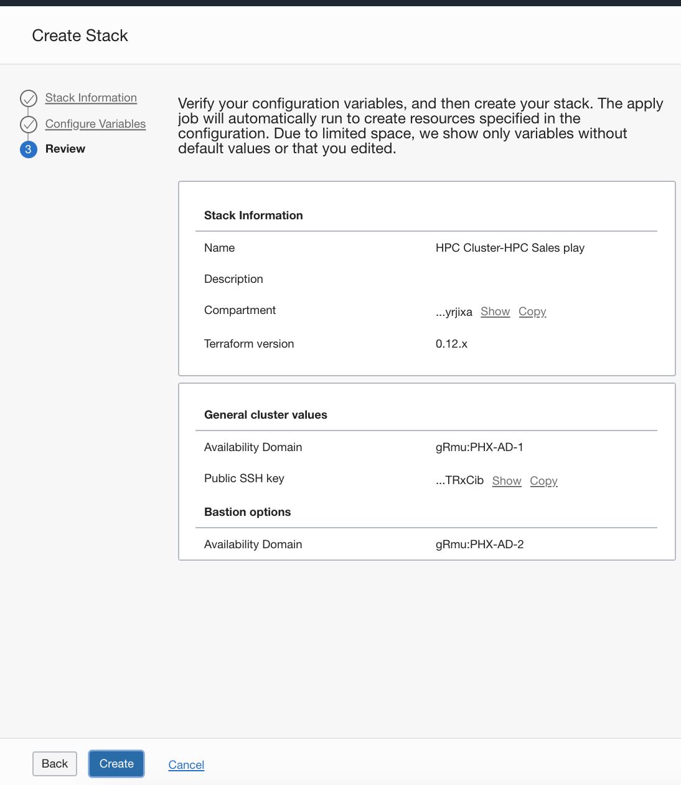
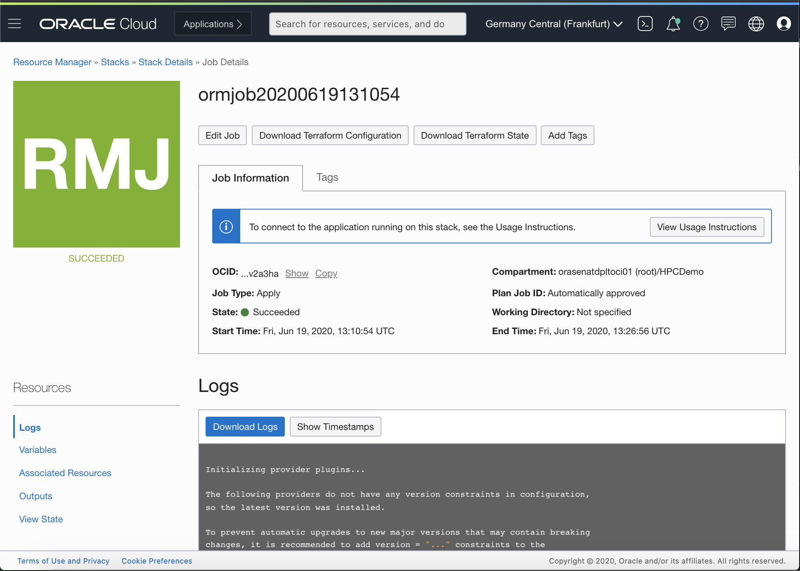
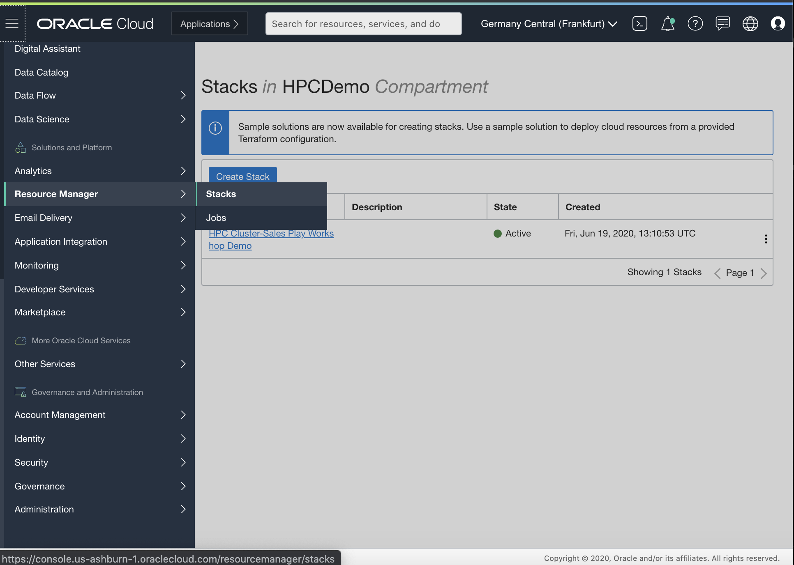

## Lab 100: Provisioning a Marketplace HPC Cluster

Search the Marketplace for HPC

Click launch stack after you select HPC Cluster from the marketplace.

This is the page you will see when you click on create stack. There is nothing we need to change on this page unless you wish to give the Stack a name or specify to deploy in a compartment that you are currently not in.

Click next and fill in the details on the next page. Make sure to select the region where you have available service limits for HPC. You will also need to provide your own public SSH key.

Click next to review the configuration.

After you hit create you will navigate to a page where your stack job is running. This process will take about 10 minutes to complete.

If you wish to see all your existing stacks you can navigate to the resource manager in the hamburger menu to view them.

