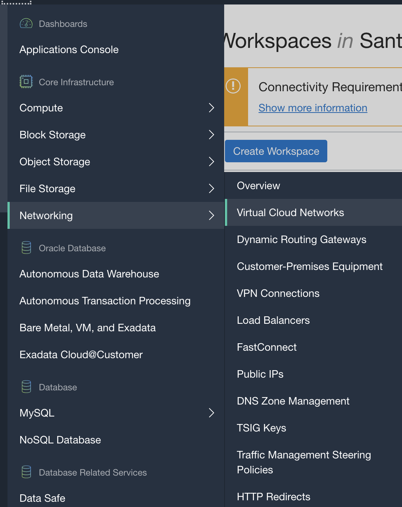
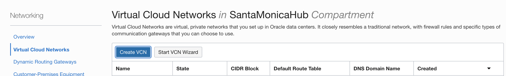
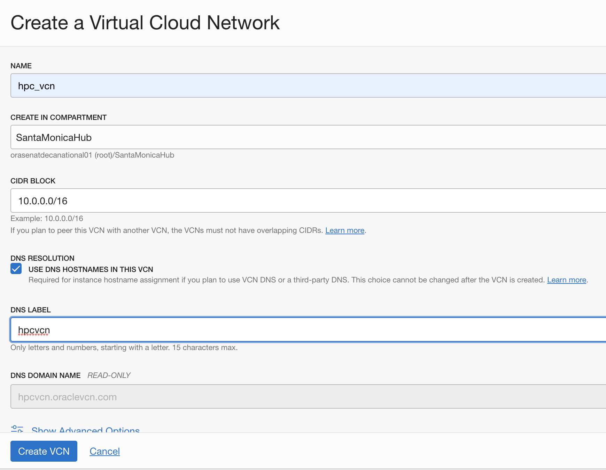

## Introduction

This lab is designed to assist in the assessment of the OpenFOAM CFD Software in Oracle Cloud Infrastructure. It automatically downloads and configures OpenFOAM. OpenFOAM is the free, open source CFD software released and developed primarily by OpenCFD Ltd since 2004. It has a large user base across most areas of engineering and science, from both commercial and academic organisations. OpenFOAM has an extensive range of features to solve anything from complex fluid flows involving chemical reactions, turbulence and heat transfer, to acoustics, solid mechanics and electromagnetics.

This lab walks you through install OpenFoam in a basic VM.Standard 2.1 shape, but for an actual deployment a larger shape like BM.HPC2.36 would be appropriate. Some high performance shapes are only available in specific Regions and Availability Domains.

We will create two nodes for this lab, the headnode for the cluster on the public subnet, and a worker compute node in the private subnet. In order to access the worker nodes, we will first create the headnode, then generate a ssh key on the headnode, and use that public key when creating the worker node.

To **log issues**, click [here](https://github.com/oracle/learning-library/issues/new) to go to the github oracle repository issue submission form.

## Objectives

As a developer, data Engineer,

- Deploy your High Performance Computing instances manually
- Create a Cluster Network
- Create a Network File System
- Set up VNC
- Install OpenFoam and Paraview 


## Required Artifacts

- An Oracle Cloud Infrastructure account with privileges to create an instance VM standard 2.1 or BM.HPC2.36 shape. 


## Steps

### **STEP 1: Provision Oracle Virtual Cloud Network**

Before creating an instance, we need to configure a Virtual Cloud Network. Select the menu on the top left, then select Networking and Virtual Cloud Networks




On the next page, select the following for your VCN:
- Name 
- Compartment
- CIDR Block (example 10.0.0.0/16)
Scroll to the bottom and click Create VCN

#### Create subnets ####
- Public Subnet

    - Name: i.e. hpc_public
    - Subnet Type: Regional 
    - CIDR Block: 10.0.0.0/24
    - Route Table: "Default Route table"
    - Subnet Access: Public Subnet
    - Security List: "Default Security List"
- Private Subnet
    - Name: hpc_private
    - Subnet Type: Regional 
    - CIDR Block: 10.0.3.0/24
    - Route Table: select Route Table created in previous step
    - Subnet Access: Private Subnet
    - Security List: select security list created in previous step
- Click **create subnet**

#### Create Internet Gateway ####

- click on hpc_vcn you created and on the **_Resources_** menu on the left side of the page, select **_Internet Gateway_**, create Internet Gateway.

*Note: That will create the internet gateway, and it will need to be associated with a route table. In this case, since the Default Route Table will be used for the public subnet, the internet gateway should be associated with that route table.*

- Add Route Rules to Route Table. On the **_Resources_** menu on the left side of the page, select **_Default Route Table for hpc_vcn_**, click **_Add Route Rules_** 
    - Target Type: Internet Gateway
    - Destination CIDR Block: 0.0.0.0/0
    - Target Internet Gateway in compartment: Internet Gateway you created


### **STEP 2: Create Cluster Nodes**

We will create two nodes for this lab, the **Headnode** for the cluster on the public subnet, and **a worker compute node** in the private subnet. In order to access the worker nodes, we will first create the headnode, then generate a ssh key on the headnode, and use that public key when creating the worker node.

_Note: For this lab we will be utilizing only the basic VM.Standard2.1 shape, but for an actual deployment a larger shape like BM.HPC2.36 would be appropriate. Some high performance shapes are only available in specific Regions and Availability Domains._


#### Create Headnode ####

- On the top left menu, select Compute and create instance.
    - Name: i.e. hpc_head
    - Image or operating system:latest version Oracle Linux(default)
    - Availblity Domain: domain available for VM.Standard 2.1 shapes
    - Instance Shape: 
        -   VM.Standard 2.1
        -   any other shapes (BM.HPC2.36 preferred if available)
    - Virtual Cloud Network: VCN created before
    - Subnet: public subnet created before
    - SSH key: Attach your public key file

- SSH into your headnode and generate ssh key specific for cluster to communicate.

    ```
    $ ssh -i <ssh_key> opc@<headnode_ip_address>

    $ ssh-keygen
    ```
    _Note: Do not change the ssh key file location (/home/opc/.ssh/id_rsa) and hit enter when asked about a passphrase (twice)._

    - Run and Copy the whole string, which will be used in creating the worker node

    ```
    $ cat ~/.ssh/id_rsa.pub
    ```
#### Create Worker Node ####
- On the top left menu, select Compute and create instance.
    - Name: i.e. hpc_worker1
    - Image or operating system:latest version Oracle Linux(default)
    - Availblity Domain: domain available for VM.Standard 2.1 shapes
    - Instance Shape: 
        -   VM.Standard 2.1
        -   any other shapes (BM.HPC2.36 preferred if available)
    - Virtual Cloud Network: VCN created before
    - Subnet: private subnet created before
    - SSH key: public key string copied from one step above.

- SSH into worker node. <br/>
Return to the console logged in to the head node, and take the private IP address and ssh into the worker node from the head node 
    
    ```
    $ ssh opc@10.x.x.x
    ```


### **STEP 3: Setup NAT Gateway**

***worker*** _node only_<br/>

- Select worker node and click on **_Attached VNICs_** in the **_resources_** menu on the left
- Select **_Edit VNIC_**
- Uncheck **_Skip Source/ Destination Check_** if it is checked and click **_Update VNICs_**

### **STEP 4: Mounting a drive**
*Note: Only if the node shape has a NVMe attached (BM.HPC2.36 has one, not VM.Standard2.1), HPC machines have local NVMe storage but it is not mounted by default.*

- SSH into your headnode and run the below commands

    ```
     $ lsblk
    ```
    *The drive should be listed with the NAME on the left (Probably nvme0n1, if it is different, change it in the next commands)*

** The headnode will have the shared drive with the installation and the model. This will be shared between all the different worker nodes. Each worker node will also mount the drive to be running locally on a NVMe drive. In this example the share directory will be 500 GB but feel free to change that. **

- Partition the drive on the worker node (optional)

    ```
     $ sudo yum -y install gdisk
    ```
    ```
     $ sudo gdisk /dev/nvme0n1
     $ > n    # Create new partition
     $ > 1    # Partition Number
     $ >      # Default start of the partition
     $ > +500G # Size of the shared partition
     $ > 8300  # Type = Linux File System
     $ > n     # Create new partition
     $ > 2     # Partition Number
     $ >       # Default start of the partition
     $ >       # Default end of the partition, to fill the whole drive

     $ > 8300  # Type = Linux File System 

     $ > w      # Write to file
     $ > Y      # Accept Changes
    ```


- Format drive on the worker nodes

    ```
    $ sudo mkfs -t ext4 /dev/nvme0n1
    ```
- Format the partitions on the headnode
    ```
    sudo mkfs -t ext4 /dev/nvme0n1p1
    sudo mkfs -t ext4 /dev/nvme0n1p2
    ```
- Create a directory and mount the drive    

    - Headnode(local and share): select /mnt/share as the mount directory for the 500G partition and /mnt/local for the larger one.

        ```
        $ sudo mkdir /mnt/local
        $ sudo mount /dev/nvme0n1p1 /mnt/share
        $ sudo chmod 777 /mnt/share
        $ sudo mount /dev/nvme0n1p2 /mnt/local
        $ sudo chmod 777 /mnt/local
     
        ```

     - Headnode(share):

        ```
        $ sudo mkdir /mnt/share
        $ sudo mount /dev/nvme0n1 /mnt/share
        $ sudo chmod 777 /mnt/share
        ```
      
    - Worker nodes: select /mnt/local as the mount directory of the whole drive.

        ```
        $ sudo mkdir /mnt/local
        $ sudo mount /dev/nvme0n1 /mnt/local
        $ sudo chmod 777 /mnt/local
        ```


### **STEP 5: Creating a Network File System**


These are detailed information about managing High Performance Compute Instance. For a complete command reference,check out OCI documentation [here](https://docs.cloud.oracle.com/en-us/iaas/Content/Compute/Tasks/managingclusternetworks.htm?Highlight=hpc).
