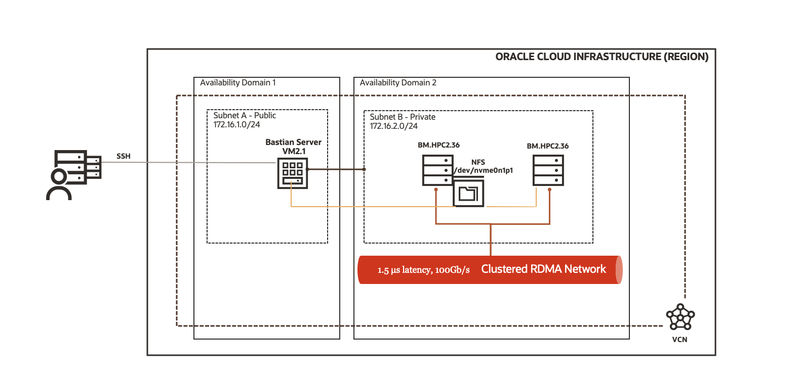
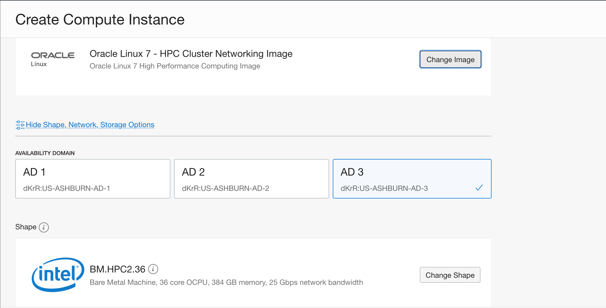
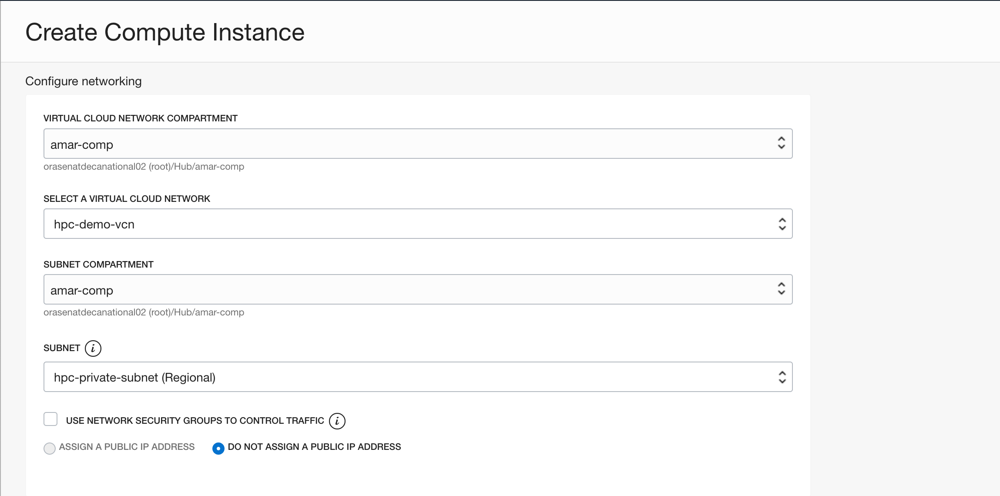
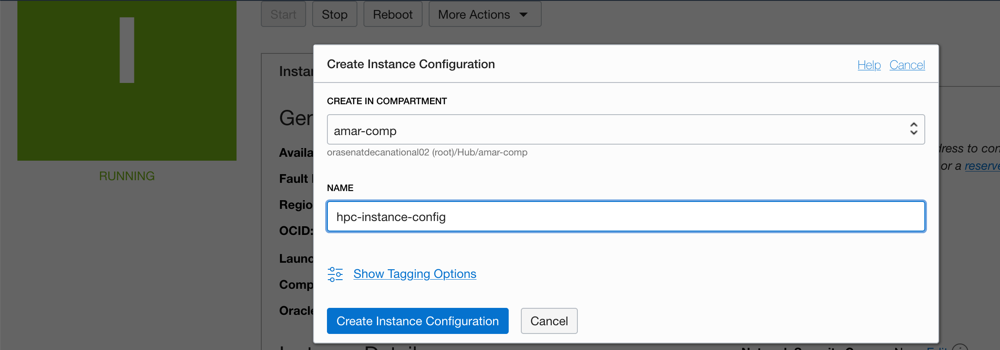
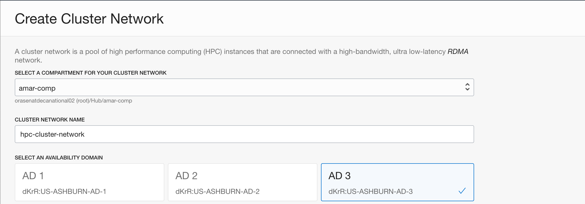
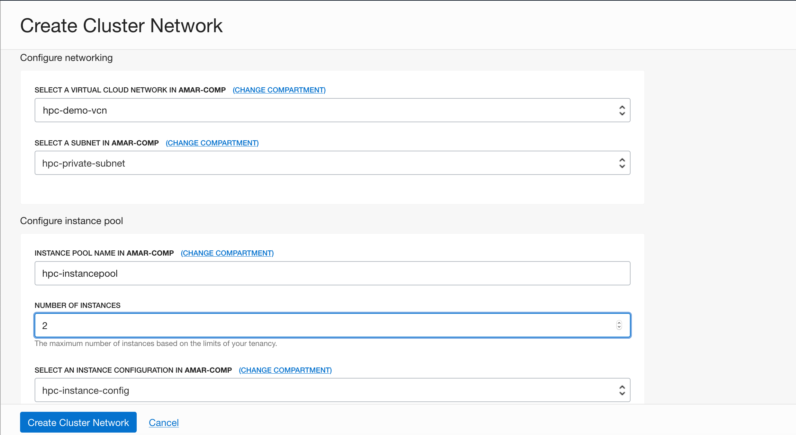
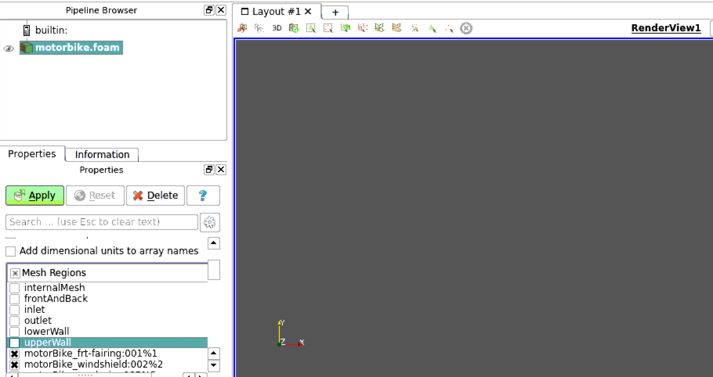
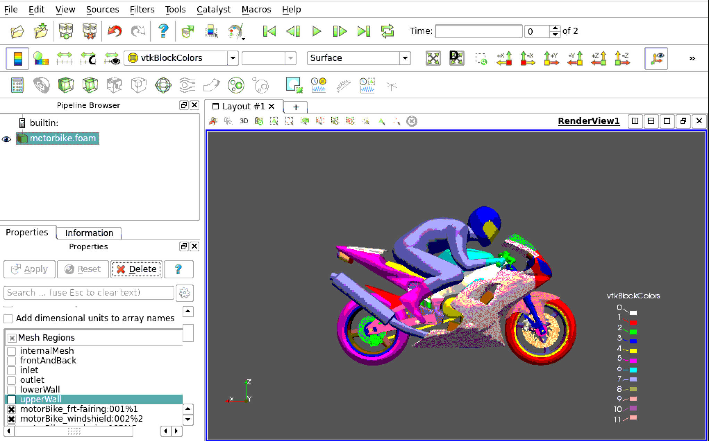

## Introduction:
This Demo let users create a manual HPC environment using OCI Cluster Network option with HPC compute nodes running on RDMA network and uses openmpi libraries. With the basic infrastructure in place, users can deploy their own applications like they do in On-Premise. To take benefit cluster network feature of OCI infrastructure users should only deploy HPC compute nodes and HPC Linux images only. Standard compute nodes and Linux images should not be used for this DEMO.

This is the reference architecture that will be deployed in this Demo.



## Objectives:
- Create cluster network and all its associate resources using OCI console
- Setup OCI VCN to deploy HPC compute instances
- Setup the RDMA network using oracle provided scripts
- Setup a shared file system(NFS for this demo)
- Optionally setup Bastion host
- Optionally configure OpenFoam application and run the workload
- Optionally setup Paraview application to view the Openfoam output


## STEPS:

### Setup VCN 
 - Create a new VCN with the following components:
   - VCN with 2 subnets. Public and Private subnet, each subnet having its own security list and route table. Public subnet should be attached to Internet Gateway and Private subnet should be Optionally attached to NAT gateway(To download application packages from internet).
   
####   VCN Details:
       CIDR: 172.16.0.0/16
       Public Subnet : 172.16.1.0/24 (Attached with Internet gateway)
       Private Subnet: 172.16.2.0/24 (Attached with NAT gateway)
       Each subnet has its own security list and Route table
                  
- Create a HPC instance in the private subnet. This is a temporary instance and will be used to create Instance configuration in OCI, which will be used during Cluster network creation.

It is mandatory to select Image as "Oracle Linux 7 - HPC Cluster Networking Image" and shape as "BM.HPC2.36" and subnet should be "Private subnet".






- Once the HPC instance is provisioned. Create instance configuration from that instance using:
  Menu -> Compute -> Instances -> INSTANCE NAME -> More Action -> Create Instance Configuration
  
  
  
- Delete the HPC instance now to free up the HPC compute resources in the tenancy.

### Create Cluster Network in OCI
 In OCI console goto Menu -> Compute -> Cluster Networks -> Create Cluster Network
  
 Provide the name of the cluster network and the Availability Domain in which the HPC compute instances will be provisioned. Make sure to select the A.D which has a minimum of 2 "BM.HPC2.36" shapes available. 
 
 
 
 
-  Provide the name of Instance pool that will be created as part of the cluster network creation. Select the number of HPC nodes that should be provisioned. Provide the name of the instance configuration, this is the same instance configuration name that we created in above step.
 
 
 
 
- Once the Cluster network is created, there will be instance pool created and 2 HPC nodes provisioned in the private subnet of the VCN. 

#### Setup Bastion server
- Using OCI Console, create a Bastion server in public subnet. Select any shape like VM.Standard2.1 in any AD of choice in the same VCN where HPC nodes are created.

- Modify the Security list for public and private subnet. Egress rules for both subnets should be set to allow traffic out to 0.0.0.0/0 CIDR on all protocols. For Ingress rules set it like this for public and private subnet.


EGRESS Rules for both subnets
         
     Stateless: NO 
     Destination: 0.0.0.0/0
     IP Protocols: All Protocols
             
             
INGRESS Rules for Public subnet:
         

    Stateless: NO            
    Source: 0.0.0.0/0
    IP Protocols: TCP
    Source Port Range: All
    Destination Port Range: 22


INGRESS Rules for Public subnet: (Optional, setup if needed to take VNC session on Bastion node)
       
    Stateless: NO    
    Source: 0.0.0.0/0
    IP Protocols: TCP
    Source Port Range: All
    Destination Port Range: 5901


INGRESS Rules for Private subnet:

    Stateless: NO          
    Source: 172.16.0.0/16
    IP Protocols: All Protocols
    Source Port Range: All
    Destination Port Range: All

          


- Copy the ssh private key in openssh format to Bastion node. It should not be ppk private key but openssh format private key for the public key that was uploaded to OCI when creating cluster network.

Copy the file to ~/.ssh/id_rsa and ~./ssh/cluster_key with permission of 600 set on it.

 ```
 [opc@hpc-bastion .ssh]$ pwd
/home/opc/.ssh
[opc@hpc-bastion .ssh]$ ls -ltr
total 16
-rw-------. 1 opc opc  400 Jul 15 15:23 authorized_keys
-rw-r--r--. 1 opc opc  172 Jul 15 15:40 known_hosts
-rw-------. 1 opc opc 1679 Jul 15 15:41 id_rsa
-rw-------. 1 opc opc 1679 Jul 15 15:42 cluster_key
[opc@hpc-bastion .ssh]$
```


- Download the RPM on Bastion node to setup the HPC infrastructure.

```
[opc@hpc-bastion ~]$
[opc@hpc-bastion ~]$ sudo rpm -Uvh https://objectstorage.us-ashburn-1.oraclecloud.com/p/5R0v9HXBjdlN3H1m1LkoOQo1zVmq8MoSuz6vPb6-ztg/n/hpc/b/rpms/o/common/oci-hpc-provision-20190905-63.7.2.x86_64.rpm
Retrieving https://objectstorage.us-ashburn-1.oraclecloud.com/p/5R0v9HXBjdlN3H1m1LkoOQo1zVmq8MoSuz6vPb6-ztg/n/hpc/b/rpms/o/common/oci-hpc-provision-20190905-63.7.2.x86_64.rpm
Preparing...                          ################################# [100%]
Updating / installing...
   1:oci-hpc-provision-20190905-63.7.2################################# [100%]
[opc@hpc-bastion ~]$
```


- Create a temporary file that contains the private IP of both HPC nodes in the following format so that HPC packages could be installed on it. 

```
[opc@hpc-bastion ~]$ cat /tmp/ips
172.16.2.3
172.16.2.4
[opc@hpc-bastion ~]$ ips=`cat /tmp/ips`
[opc@hpc-bastion ~]$ echo $ips
172.16.2.3 172.16.2.4
[opc@hpc-bastion ~]$
```

- Execute the script now from bastion host

```
[opc@hpc-bastion ~]$ /opt/oci-hpc/setup/provision/HPC_PROVISION/hpc_provision_cluster_nodes.sh -p -i /home/opc/.ssh/id_rsa $ips
HPC_Provision_Cluster_Nodes: hpc-bastion: TAR_ARCHIVE = HPC_PROVISION_PROVISIONAPI1.5-OFED4.4-63.7.2-20190905.tgz
HPC_Provision_Cluster_Nodes: hpc-bastion: TAR_ARCHIVE_PATH = /tmp/hpc_provision.11935/HPC_PROVISION_PROVISIONAPI1.5-OFED4.4-63.7.2-20190905.tgz
HPC_Provision_Cluster_Nodes: hpc-bastion: I_PRIVATE_KEY=/home/opc/.ssh/id_rsa
HPC_Provision_Cluster_Nodes: hpc-bastion: I_USER=opc
HPC_Provision_Cluster_Nodes: hpc-bastion: I_HOSTS= 172.16.2.3 172.16.2.4

HPC_Provision_Cluster_Nodes: hpc-bastion: cluster provision with:
                            user: opc
                      access key: /home/opc/.ssh/id_rsa
                  default subnet: 192.18.240.0/20
                    local volume: /mnt/localdisk
                      nfs export: /mnt/localdisk/nfs-export
                       nfs mount: /mnt/nfs-share
                           hosts: 172.16.2.3 172.16.2.4
                      batch mode: no
                 background mode: yes


HPC_Provision_Cluster_Nodes: hpc-bastion: Continue HPC Cluster setup with these parameters? (n/y)   yes
```

- The script will be executed in the background. Monitor the logfile and after its successful execution, the logfile should contain the following message at the end. The total time for execution of the script should be less than 10 minutes.

```
[opc@hpc-bastion ~]$ tail -100f /tmp/hpc_provision.11935/2020-07-15T15\:48\:00+0000.log

HPC_Provision_Cluster_Nodes: hpc-bastion: cluster is fully setup.
```


-  Validate setup:
 - From Bastion server, ssh to the nodes to validate the setup


#### NODE1(172.16.2.3):

- Check the local disk mount on NODE1
```
[opc@hpc-demo ~]$ df -h
Filesystem      Size  Used Avail Use% Mounted on
devtmpfs        189G     0  189G   0% /dev
tmpfs           189G     0  189G   0% /dev/shm
tmpfs           189G   19M  189G   1% /run
tmpfs           189G     0  189G   0% /sys/fs/cgroup
/dev/sda3        39G  3.6G   35G  10% /
/dev/sda1       200M  9.8M  191M   5% /boot/efi
/dev/nvme0n1p1  5.9T   33M  5.9T   1% /mnt/localdisk
tmpfs            38G     0   38G   0% /run/user/1000
[opc@hpc-demo ~]$
```

- Check the locally bind /mnt/nfs-share on NODE1
```
[opc@hpc-demo ~]$ cat /etc/fstab

#
# /etc/fstab
# Created by anaconda on Tue Aug 14 00:57:19 2018
#
# Accessible filesystems, by reference, are maintained under '/dev/disk'
# See man pages fstab(5), findfs(8), mount(8) and/or blkid(8) for more info
#
UUID=6a147fcc-2a50-49e5-b331-f9dccd37777f /                       xfs     defaults,noatime,_netdev,_netdev 0 0
UUID=8EED-5C72          /boot/efi               vfat    defaults,uid=0,gid=0,umask=0077,shortname=winnt,_netdev,_netdev,x-initrd.mount 0 0
UUID=fff14da8-ec93-4146-81ba-78b0ff0e9d2e swap                    swap    defaults,noatime,_netdev,x-initrd.mount 0 0
######################################
## ORACLE CLOUD INFRASTRUCTURE CUSTOMERS
##
## If you are adding an iSCSI remote block volume to this file you MUST
## include the '_netdev' mount option or your instance will become
## unavailable after the next reboot.
## SCSI device names are not stable across reboots; please use the device UUID instead of /dev path.
##
## Example:
## UUID="94c5aade-8bb1-4d55-ad0c-388bb8aa716a"   /data1    xfs       defaults,noatime,_netdev      0      2
##
## More information:
## https://docs.us-phoenix-1.oraclecloud.com/Content/Block/Tasks/connectingtoavolume.htm
/dev/nvme0n1p1 /mnt/localdisk xfs defaults,noatime 0 2
/mnt/localdisk/nfs-export /mnt/nfs-share none bind
[opc@hpc-demo ~]$
```

- Check the NFS server export mount and network permissions
```
[opc@hpc-demo ~]$ showmount -e
Export list for hpc-demo:
/mnt/localdisk/nfs-export 172.16.2.3/255.255.255.0
[opc@hpc-demo ~]$
[opc@hpc-demo ~]$
[opc@hpc-demo ~]$ cat /etc/exports.d/hpc_nfs_share.exports
/mnt/localdisk/nfs-export 172.16.2.3/255.255.255.0(rw,sync,no_root_squash,no_all_squash,no_subtree_check,insecure_locks)
[opc@hpc-demo ~]$
```


#### NODE2(172.16.2.4):

- Check the NFS mount disk pointing to NODE1
```
[opc@hpc-demo-769663 ~]$ df -h
Filesystem                                      Size  Used Avail Use% Mounted on
devtmpfs                                        189G     0  189G   0% /dev
tmpfs                                           189G     0  189G   0% /dev/shm
tmpfs                                           189G   19M  189G   1% /run
tmpfs                                           189G     0  189G   0% /sys/fs/cgroup
/dev/sda3                                        39G  3.6G   35G  10% /
/dev/sda1                                       200M  9.8M  191M   5% /boot/efi
/dev/nvme0n1p1                                  5.9T   33M  5.9T   1% /mnt/localdisk
nfs-server.local.vcn:/mnt/localdisk/nfs-export  5.9T   32M  5.9T   1% /mnt/nfs-share
tmpfs                                            38G     0   38G   0% /run/user/1000
[opc@hpc-demo-769663 ~]$
[opc@hpc-demo-769663 ~]$
```
- Check NFS mount entry in the fstab file
```
[opc@hpc-demo-769663 ~]$ cat /etc/fstab

#
# /etc/fstab
# Created by anaconda on Tue Aug 14 00:57:19 2018
#
# Accessible filesystems, by reference, are maintained under '/dev/disk'
# See man pages fstab(5), findfs(8), mount(8) and/or blkid(8) for more info
#
UUID=6a147fcc-2a50-49e5-b331-f9dccd37777f /                       xfs     defaults,noatime,_netdev,_netdev 0 0
UUID=8EED-5C72          /boot/efi               vfat    defaults,uid=0,gid=0,umask=0077,shortname=winnt,_netdev,_netdev,x-initrd.mount 0 0
UUID=fff14da8-ec93-4146-81ba-78b0ff0e9d2e swap                    swap    defaults,noatime,_netdev,x-initrd.mount 0 0
######################################
## ORACLE CLOUD INFRASTRUCTURE CUSTOMERS
##
## If you are adding an iSCSI remote block volume to this file you MUST
## include the '_netdev' mount option or your instance will become
## unavailable after the next reboot.
## SCSI device names are not stable across reboots; please use the device UUID instead of /dev path.
##
## Example:
## UUID="94c5aade-8bb1-4d55-ad0c-388bb8aa716a"   /data1    xfs       defaults,noatime,_netdev      0      2
##
## More information:
## https://docs.us-phoenix-1.oraclecloud.com/Content/Block/Tasks/connectingtoavolume.htm
/dev/nvme0n1p1 /mnt/localdisk xfs defaults,noatime 0 2
nfs-server.local.vcn:/mnt/localdisk/nfs-export /mnt/nfs-share nfs defaults,noatime,bg,timeo=100,ac,actimeo=120,nocto,rsize=1048576,wsize=1048576,nolock,local_lock=none,mountproto=tcp,sec=sys 0 0
[opc@hpc-demo-769663 ~]$
```

#### Stop the linux firewall on both the HPC nodes.

- NODE1
```
[opc@hpc-demo ~]$ sudo systemctl stop firewalld
[opc@hpc-demo ~]$ sudo systemctl disable firewalld
Removed symlink /etc/systemd/system/multi-user.target.wants/firewalld.service.
Removed symlink /etc/systemd/system/dbus-org.fedoraproject.FirewallD1.service.
[opc@hpc-demo ~]$
```

- NODE2
```
[opc@hpc-demo-769663 ~]$ sudo systemctl stop firewalld
[opc@hpc-demo-769663 ~]$
[opc@hpc-demo-769663 ~]$ sudo systemctl disable firewalld
Removed symlink /etc/systemd/system/multi-user.target.wants/firewalld.service.
Removed symlink /etc/systemd/system/dbus-org.fedoraproject.FirewallD1.service.
[opc@hpc-demo-769663 ~]$
```

#### On Bastion server add the NFS service in the Linux firewall


- Adding security rules in Linux Firewall

```
[opc@hpc-bastion ~]$ sudo firewall-cmd --permanent --zone=public --add-service=nfs
success
[opc@hpc-bastion ~]$ sudo firewall-cmd --reload
success
[opc@hpc-bastion ~]$ sudo firewall-cmd --list-services
dhcpv6-client nfs ssh
[opc@hpc-bastion ~]$
```

- Adding folders to mount NFS storage on Bastion
```
[opc@hpc-bastion mnt]$ cd /mnt/
[opc@hpc-bastion mnt]$ sudo mkdir nfs-share
[opc@hpc-bastion mnt]$ sudo chown -R opc:opc /mnt/nfs-share/
[opc@hpc-bastion mnt]$ sudo chmod -R 755 /mnt/nfs-share/
[opc@hpc-bastion mnt]$ ls -ltr
total 0
drwxr-xr-x. 2 opc opc 6 Jul 15 15:59 nfs-share
[opc@hpc-bastion mnt]$
```


#### Add the entries in exports file on NODE1 to access NFS server from Bastion node.

- NODE1(172.16.2.3):
```
[opc@hpc-demo ~]$ cat /etc/exports.d/hpc_nfs_share.exports
/mnt/localdisk/nfs-export 172.16.2.3/255.255.255.0(rw,sync,no_root_squash,no_all_squash,no_subtree_check,insecure_locks)
[opc@hpc-demo ~]$
[opc@hpc-demo ~]$
[opc@hpc-demo ~]$ sudo vi /etc/exports.d/hpc_nfs_share.exports

-- ADD the following line in the file
/mnt/localdisk/nfs-export 172.16.0.0/16(rw,sync,no_root_squash,no_all_squash,no_subtree_check,insecure_locks)
[opc@hpc-demo ~]$ sudo exportfs -ra
[opc@hpc-demo ~]$
[opc@hpc-demo ~]$ showmount -e
Export list for hpc-demo:
/mnt/localdisk/nfs-export 172.16.0.0/16,172.16.2.3/255.255.255.0
[opc@hpc-demo ~]$
[opc@hpc-demo ~]$ cat /etc/exports.d/hpc_nfs_share.exports
/mnt/localdisk/nfs-export 172.16.2.3/255.255.255.0(rw,sync,no_root_squash,no_all_squash,no_subtree_check,insecure_locks)
/mnt/localdisk/nfs-export 172.16.0.0/16(rw,sync,no_root_squash,no_all_squash,no_subtree_check,insecure_locks)
[opc@hpc-demo ~]$
```

- On Bastion server add the hosts entries to make it look like one of the HPC nodes


```
[opc@hpc-bastion mnt]$ cat /etc/hosts
127.0.0.1   localhost localhost.localdomain localhost4 localhost4.localdomain4
::1         localhost localhost.localdomain localhost6 localhost6.localdomain6
172.16.1.2 hpc-bastion.hpcpublicsubnet.hpcdemovcn.oraclevcn.com hpc-bastion
[opc@hpc-bastion mnt]$

[opc@hpc-bastion mnt]$ cat /etc/hosts
127.0.0.1   localhost localhost.localdomain localhost4 localhost4.localdomain4
::1         localhost localhost.localdomain localhost6 localhost6.localdomain6
172.16.1.2 hpc-bastion.hpcpublicsubnet.hpcdemovcn.oraclevcn.com hpc-bastion

172.16.2.4 hpc-demo-769663.hpcprivatesubne.hpcdemovcn.oraclevcn.com hpc-demo-769663
# nfs host
172.16.2.3 nfs-server.local.vcn nfs-server
# hosts
172.16.2.3 hpc-demo.hpcprivatesubne.hpcdemovcn.oraclevcn.com hpc-demo
172.16.2.4 hpc-demo-769663.hpcprivatesubne.hpcdemovcn.oraclevcn.com hpc-demo-769663
# rdma hosts
192.18.240.1 hpc-cluster-node-01-rdma.local.rdma hpc-cluster-node-01-rdma
192.18.240.2 hpc-cluster-node-02-rdma.local.rdma hpc-cluster-node-02-rdma
# vcn hosts
172.16.2.3 hpc-cluster-node-01.local.vcn hpc-cluster-node-01
172.16.2.4 hpc-cluster-node-02.local.vcn hpc-cluster-node-02
[opc@hpc-bastion mnt]$
```

- Add the below entry to mount NFS disks on Bastion server in the /etc/fstab file

```
nfs-server.local.vcn:/mnt/localdisk/nfs-export /mnt/nfs-share nfs defaults,noatime,bg,timeo=100,ac,actimeo=120,nocto,rsize=1048576,wsize=1048576,nolock,local_lock=none,mountproto=tcp,sec=sys 0 0
```


```
[opc@hpc-bastion mnt]$ cat /etc/fstab

#
# /etc/fstab
# Created by anaconda on Fri Jun 26 23:19:24 2020
#
# Accessible filesystems, by reference, are maintained under '/dev/disk'
# See man pages fstab(5), findfs(8), mount(8) and/or blkid(8) for more info
#
UUID=35f85409-bcd9-453c-8079-9239184b14a7 /                       xfs     defaults,_netdev,_netdev 0 0
UUID=27BE-6CDE          /boot/efi               vfat    defaults,uid=0,gid=0,umask=0077,shortname=winnt,_netdev,_netdev,x-initrd.mount 0 0
UUID=6822e1b7-71bd-4846-8354-19b37890da03 swap                    swap    defaults,_netdev,x-initrd.mount 0 0
######################################
## ORACLE CLOUD INFRASTRUCTURE CUSTOMERS
##
## If you are adding an iSCSI remote block volume to this file you MUST
## include the '_netdev' mount option or your instance will become
## unavailable after the next reboot.
## SCSI device names are not stable across reboots; please use the device UUID instead of /dev path.
##
## Example:
## UUID="94c5aade-8bb1-4d55-ad0c-388bb8aa716a"   /data1    xfs       defaults,noatime,_netdev      0      2
##
## More information:
## https://docs.us-phoenix-1.oraclecloud.com/Content/Block/Tasks/connectingtoavolume.htm

nfs-server.local.vcn:/mnt/localdisk/nfs-export /mnt/nfs-share nfs defaults,noatime,bg,timeo=100,ac,actimeo=120,nocto,rsize=1048576,wsize=1048576,nolock,local_lock=none,mountproto=tcp,sec=sys 0 0
[opc@hpc-bastion mnt]$
```

```
[opc@hpc-bastion mnt]$ sudo mount -a
[opc@hpc-bastion mnt]$
[opc@hpc-bastion mnt]$
[opc@hpc-bastion mnt]$ df -h
Filesystem                                      Size  Used Avail Use% Mounted on
devtmpfs                                        7.2G     0  7.2G   0% /dev
tmpfs                                           7.3G     0  7.3G   0% /dev/shm
tmpfs                                           7.3G  8.7M  7.2G   1% /run
tmpfs                                           7.3G     0  7.3G   0% /sys/fs/cgroup
/dev/sda3                                        39G  2.1G   37G   6% /
/dev/sda1                                       200M  9.7M  191M   5% /boot/efi
tmpfs                                           1.5G     0  1.5G   0% /run/user/1000
tmpfs                                           1.5G     0  1.5G   0% /run/user/0
nfs-server.local.vcn:/mnt/localdisk/nfs-export  5.9T   32M  5.9T   1% /mnt/nfs-share
[opc@hpc-bastion mnt]$
```

### OPTIONAL - Setup of Openfoam application
 - Setup Openfoam on Node1. Follow the steps if you want to install Openfoam application which is a CFD based application and run it against HPC nodes for DEMO purpose.


- Setup NAT gateway to private subnet and setup route table for it.

- Download the openfoam application binaries on Node1.

```
wget https://objectstorage.us-phoenix-1.oraclecloud.com/p/f48lM3aXtcEiCGJihz-sxpH808zie7VEbBHbihuZ2YI/n/hpc/b/HPC_APPS/o/openfoam7_OL77_RDMA.tar
tar -xvf openfoam7_OL77_RDMA.tar
[opc@hpc-demo nfs-share]$ ls
./  ../  OpenFOAM/  openfoam7_OL77_RDMA.tar
[opc@hpc-demo nfs-share]$
```

- Download the motorbike CFD based demo setup

```
wget https://objectstorage.us-phoenix-1.oraclecloud.com/p/V7-M6bL-HWGKNLiZ2iCiKdG3ehzs3nkjwX6_zDNEbSM/n/hpc/b/HPC_BENCHMARKS/o/motorbike_RDMA.tgz
tar -xvf motorbike_RDMA.tgz
[opc@hpc-demo nfs-share]$ ls
./  ../  0/  Allclean*  Allrun*  constant/  motorbike_RDMA.tgz  system/
[opc@hpc-demo nfs-share]$ cd
```


- Setup the bash profile on Node1 and Node2

```
echo export PATH=/usr/mpi/gcc/openmpi-3.1.1rc1/bin/:\$PATH | sudo tee -a ~/.bashrc
echo export LD_LIBRARY_PATH=/usr/mpi/gcc/openmpi-3.1.1rc1/lib64/:\$LD_LIBRARY_PATH | sudo tee -a ~/.bashrc
echo source /mnt/nfs-share/OpenFOAM/OpenFOAM-7/etc/bashrc | sudo tee -a ~/.bashrc

[opc@hpc-demo ~]$ cat ~/.bashrc
# .bashrc

# Source global definitions
if [ -f /etc/bashrc ]; then
    . /etc/bashrc
fi

# Uncomment the following line if you don't like systemctl's auto-paging feature:
# export SYSTEMD_PAGER=

# User specific aliases and functions
#
# DO_NOT_REMOVE_THE_FOLLOWING_LINE
source /etc/opt/oci-hpc/bashrc/.bashrc
[ -f /home/opc/.bash_history ] || rm -f /home/opc/.bash_history && touch /home/opc/.bash_history
export PATH=/usr/mpi/gcc/openmpi-3.1.1rc1/bin/:$PATH
export LD_LIBRARY_PATH=/usr/mpi/gcc/openmpi-3.1.1rc1/lib64/:$LD_LIBRARY_PATH
source /mnt/nfs-share/OpenFOAM/OpenFOAM-7/etc/bashrc
```

- Load the bashrc on node1 from where the workload will be executed

```
Source the bashrc file on Node1
source ~/.bashrc
```


- Create hostfile on node1 now that contains private IPs of both nodes along with CPU count on both HPC nodes

```
cd /mnt/nfs-share/
echo '172.16.2.3 cpu=36' > hostfile
echo '172.16.2.4 cpu=36' >> hostfile
cat hostfile
172.16.2.3 cpu=36
172.16.2.4 cpu=36
```


- Node1 will be used to run the workload.

```
cd /mnt/nfs-share/
[opc@hpc-demo nfs-share]$ ./Allrun 36
Cleaning /mnt/nfs-share case
Mesh Dimensions: (40 16 16)
Cores:36: 6, 6, 1
Running surfaceFeatures on /mnt/nfs-share
Running blockMesh on /mnt/nfs-share
Running decomposePar on /mnt/nfs-share
Running snappyHexMesh
Running patchsummary
Running potentialFoam
Running simpleFoam
Running reconstructParMesh on /mnt/nfs-share
Running reconstructPar on /mnt/nfs-share
217.74
[opc@hpc-demo nfs-share]$
```


### OPTIONAL - Setup of Paraview visualization application on Bastion node to view rendered image of motorbike example above


- Configure and Install VNC server and Linux Desktop on Bastion server

```
sudo yum install tigervnc-server
sudo yum groupinstall "X Window System"
sudo yum groupinstall "MATE Desktop"
sudo yum groupinstall "Server with GUI"
sudo yum install mesa-libGLU
```

```
[opc@hpc-bastion ~]$ vncpasswd
Password:
Verify:
Would you like to enter a view-only password (y/n)?
A view-only password is not used
```

- Start the vnc server and check the port on which it is running. In this example VNC is running on port 5901
```
vncserver
 ps -eaf | grep vnc
```
- Add the port in Linux firewall of Bastion host

```
sudo firewall-cmd --zone=public --permanent --add-port=5901/tcp
sudo firewall-cmd --reload
sudo firewall-cmd --list-ports
```


- Add security rules for public subnet for port 5901


- Download Paraview software on Bastion Node

```
cd /mnt/nfs-share
curl -d submit="Download" -d version="v4.4" -d type="binary" -d os="Linux" -d downloadFile="ParaView-4.4.0-Qt4-Linux-64bit.tar.gz" https://www.paraview.org/paraview-downloads/download.php > file.tar.gz

tar -xvf file.tar.gz
```

- VNC session
Start a VNC session on bastion node, from VNCViewer on your local machine on port 5901.

```
[opc@hpc-bastion ~]$ cd /mnt/nfs-share/ParaView-4.4.0-Qt4-Linux-64bit/bin/
[opc@hpc-bastion ~]$ ./paraview
```

- In Paraview application window, File -> Open -> Path "/mnt/nfs-share/work" and select file name motorbike.foam. It will be zero byte file and that should be fine.

- On Left of the window, Under Properties tab, select Mesh Regions to select all the values and then unselect the top values which does not start with motorBike_ prefix. Make sure that all values starting with motorBike_ are selected. Click on the Apply button, some errors will pop up, ignore the error window that pops up to view the rendering of the image in VNC console.




- An image like below will be rendered on the screen. Based on some display settings, the image on the screen might look a bit different.



### This completes the demo for setting up of HPC compute instances using cluster network and optionally setting up of Openfoam application.

